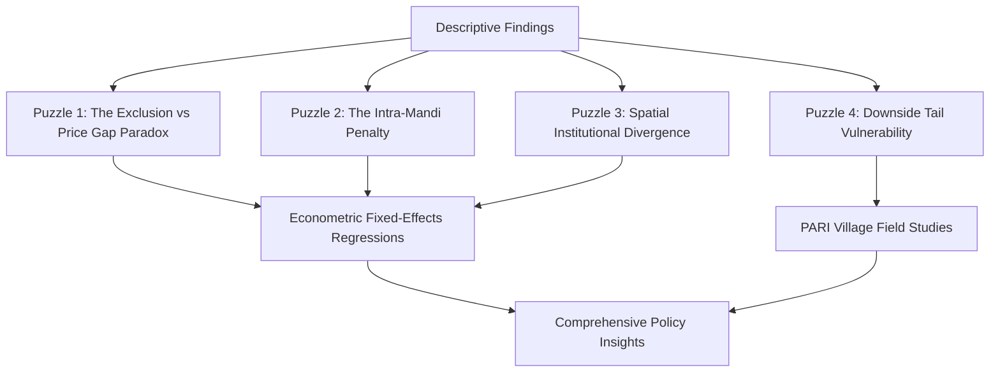

<div class="text-center mt-4 mb-4">
  <a href="https://github.com/ashwinnsr/agricultural-market-discrimination" 
     class="btn btn-primary" 
     target="_blank" 
     rel="noopener noreferrer">
    <i class="fab fa-github"></i> View Code & Replication Data on GitHub
  </a>
</div>

---

## 1. Research Problem & Theoretical Motivation

In developing agrarian economies, agricultural marketing is rarely a frictionless, anonymous exchange between buyers and sellers. Output markets remain embedded within local social hierarchies, informal credit relations, and historical patterns of agrarian dominance. While standard economic theory treats price differentials as reflections of transaction costs, quality gradients, or transport friction, agrarian political economy highlights how institutional barriers and social identity shape the terms of market exchange.

Two conceptual frameworks guide this investigation:
1. **Selective Inclusion (Thorat & Newman, 2010):** Marginalized social groups are not necessarily excluded from markets outright; rather, they are included on systematically disadvantageous terms—such as receiving lower prices for identical produce or facing higher intermediation charges.
2. **Unfavourable Inclusion (Sen, 2000):** Economic integration occurs under unequal, dependent, or exploitative conditions (e.g., interlinked credit-output contracts where distress sales at harvest time suppress realized prices).

In the Indian context, continuous policy efforts—such as Agricultural Produce Market Committee (APMC) mandi regulations, electronic trading portals (e-NAM), and Minimum Support Price (MSP) procurement operations—aim to formalize trade and protect farmers from local monopsonies. However, whether marginalized social groups—specifically Scheduled Castes (SC) and Scheduled Tribes (ST)—can effectively access these formal institutions, and whether formal access delivers price parity, remains a crucial empirical question.

---

## 2. Research Questions

This study investigates the joint role of **social identity (caste)** and **economic scale (landholding)** in shaping agricultural marketing access and price realization across rural India:

1. **Do farmers from different social groups (General, OBC, SC, ST) receive different unit prices for the same crop?**
2. **If price differentials exist, are they primarily explained by structural and spatial sorting (differences in marketing channels, state-level procurement regimes, farm size, or sale timing), or do identity-based gaps persist within specific channels and regions?**
3. **How does market access differ at the institutional margin—who reaches regulated formal buyers (APMC mandis, government procurement, cooperatives), and who remains confined to local village traders?**

---

## Some Descriptive Statistics

Before estimating econometric regressions, an exhaustive descriptive and non-parametric exploratory data analysis is essential for three methodological reasons. Linear regressions impose specific functional forms that can mask heavy-tailed distributions, price clustering at modal points, and localized distributional asymmetries. Non-parametric rank tests (Kruskal-Wallis, Dunn pairwise tests with Benjamini-Hochberg FDR adjustment, and Mann-Whitney rank-biserial effect sizes) provide robust baseline evidence. Furthermore, by decomposing price variance within households across multiple transactions and between households within states, we establish how much variation is structural (spatial/regional) versus transaction-specific. Finally, looking only at mean or median prices overlooks harvest-time distress sales. Disaggregating the share of transactions falling below the seasonal crop median captures asymmetric downside vulnerability.

---

## 4. Data & Pipeline Architecture

The empirical analysis utilizes unit-level microdata from the **NSS 77th Round Situation Assessment Survey (SAS) of Agricultural Households (2019)**, conducted by the National Statistical Office (NSO), Government of India.

* **Sample Size:** $74{,}565$ crop-disposal transaction records across $52{,}634$ unique agricultural households covering two agricultural visits (Visit 1: July–December 2018; Visit 2: January–June 2019).
* **Crop Categorization:** Cleanly rebinned by NSS crop codes into **Wheat** (Code `0106`, $N = 8{,}644$), **Paddy** (Code `0101`, $N = 18{,}245$), and **Others** ($N = 47{,}676$, encompassing pulses, oilseeds, cash crops, fruits, and vegetables).
* **Survey Weights:** All proportion and price summary estimates incorporate household sampling weights (`weight` / `wt_num`).

The descriptive statistics pipeline is executed sequentially via five modular R scripts in [`code/scripts/descriptive_stats/`](code/scripts/descriptive_stats/):
* `01_household_price_variation.R`: Micro-level price variance decomposition.
* `02_state_price_variation.R`: State-level price dispersion and regional variance shares.
* `03_crosstabs_rebinned.R`: Caste $\times$ Channel $\times$ State cross-tabulations.
* `04_price_tests.R`: Inferential statistical tests (Kruskal-Wallis, Dunn pairwise with Benjamini-Hochberg FDR, Mann-Whitney effect sizes).
* `05_below_median_crosstab.R`: Lower-tail distress sale analysis (below-median price shares).

---

## 5. Descriptive Results & Nuanced Findings

```
===================================================================================
                               KEY SUMMARY OF FINDINGS
===================================================================================
1. Headline Price Gaps:       Modest on average (-2.9% in Wheat, -3.2% in Paddy).
2. Distributional Tests:      Statistically significant SC penalty in Wheat (p < 0.001);
                              negligible and mixed nationwide median penalty in Paddy.
3. Lower-Tail Vulnerability:  In peak Wheat harvest, 41.6% of SC sales fall below median
                              vs 27.2% for General farmers (a 14.4 pp distress penalty).
4. Market Channel Margin:     77.4% sell to local traders nationally; but General farmers 
                              are 2x more likely to access formal channels in Wheat (19.1% vs 9.9%).
5. Regional Heterogeneity:    Severe SC exclusion in commercial states (Haryana, MP);
                              universal parity in decentralized procurement states (CG, PB, TS);
                              universal absence of formal buyers in UP and Bihar (<8%).
6. Intra-Channel Penalty:     Inside APMC mandis, SC paddy sellers realize 11.8% lower prices.
===================================================================================
```

### 5.1. Unconditional Price Summary & Caste Price Gaps

At the all-India level, raw price differences between caste categories appear modest in percentage terms:

| Rebinned Crop Category | Metric | General | OBC | SC | ST | SC Gap vs General (%) | ST Gap vs General (%) |
| :--- | :--- | :---: | :---: | :---: | :---: | :---: | :---: |
| **Wheat** ($N = 8{,}644$) | Mean (₹/kg)<br>Median (₹/kg) | 17.46<br>18.00 | 17.13<br>17.00 | 16.96<br>17.00 | 17.20<br>17.00 | **-2.9%**<br>*-5.6%* | **-1.5%**<br>*-5.6%* |
| **Paddy** ($N = 18{,}245$) | Mean (₹/kg)<br>Median (₹/kg) | 16.02<br>15.00 | 16.40<br>15.50 | 15.50<br>15.00 | 16.30<br>15.00 | **-3.2%**<br>*0.0%* | **+1.7%**<br>*0.0%* |
| **Others** ($N = 47{,}676$) | Mean (₹/kg)<br>Median (₹/kg) | 39.32<br>28.00 | 40.62<br>30.00 | 34.43<br>28.00 | 35.78<br>29.00 | **-12.4%**<br>*0.0%* | **-9.0%**<br>*+3.6%* |

*Note: While the "Others" category displays a larger headline SC gap ($-12.4\%$), this group combines disparate high-value cash crops and coarse grains with different crop compositions across social groups, requiring crop-by-crop disaggregation.*

---

### 5.2. Inferential Testing & Effect Sizes: Wheat vs. Paddy Asymmetry

Non-parametric hypothesis testing reveals critical nuances between crops:

1. **Overall Distributional Differences (Kruskal-Wallis Tests):**
   * **Wheat:** $H = 97.47, p = 5.37 \times 10^{-21}$ (Statistically significant)
   * **Paddy:** $H = 205.81, p = 2.45 \times 10^{-44}$ (Statistically significant)
   * **Others:** $H = 175.78, p = 7.15 \times 10^{-38}$ (Statistically significant)

2. **Dunn Pairwise Comparisons (with Benjamini-Hochberg FDR Correction):**
   * In **Wheat**, General caste farmers realize significantly higher prices than OBC ($Z = 9.85, p_{\text{adj}} < 0.001$) and SC farmers ($Z = 7.66, p_{\text{adj}} < 0.001$).
   * In **Paddy**, the pattern is non-linear: OBC farmers receive significantly higher prices than General farmers ($Z = -4.91, p_{\text{adj}} < 0.001$), driven by extensive OBC participation in state procurement, while the General–SC difference is marginal ($Z = 1.76, p_{\text{adj}} = 0.039$).

3. **Mann-Whitney U & Rank-Biserial Effect Sizes ($r_{\text{rb}}$):**
   * **Wheat (SC vs. General):** $W = 1{,}822{,}426, p = 5.27 \times 10^{-13}$, with a rank-biserial effect size of **$r = -0.160$ (small, adverse SC penalty)**.
   * **Paddy (SC vs. General):** $W = 6{,}496{,}834, p = 0.079$, with an effect size of **$r = 0.026$ (negligible/near zero)**.
   * **State-Level Discipline:** Across 37 state-crop combinations with adequate cell sizes ($n_{\text{General}} \ge 30, n_{\text{SC}} \ge 30$), only 13 show statistically significant differences after Benjamini-Hochberg correction, confirming that caste penalties are state- and crop-specific rather than uniform nationwide.

---

### 5.3. The Market Channel Margin: The Universal Baseline vs. The Privileged Door

A central empirical question is how social groups access different marketing intermediaries:

| Marketing Channel | General (%) | OBC (%) | SC (%) | ST (%) | All-India Total (%) |
| :--- | :---: | :---: | :---: | :---: | :---: |
| **Local Private Trader** | 76.3% | 75.4% | **80.5%** | **83.6%** | **77.4%** |
| **APMC Mandi** | **6.1%** | **6.1%** | 3.2% | 4.1% | **5.5%** |
| **Government Procurement** | 3.8% | **4.7%** | 3.8% | 1.5% | **3.9%** |
| **Cooperative / FPO** | 2.5% | **2.7%** | 1.6% | 2.2% | **2.4%** |
| **Any Formal Channel (Combined)** | **18.3%** | **18.9%** | **13.4%** | **10.8%** | **17.0%** |

```
Chi-Square Test of Independence (Caste x Formal Access):
  - Pooled All Crops:  Chi2 = 787.49,  df = 3,  p < 2.2e-160
  - Wheat:             Chi2 =  89.61,  df = 3,  p = 2.66e-19
  - Paddy:             Chi2 = 174.02,  df = 3,  p = 1.73e-37
```

#### Nuance in Interpretation:
* **The Universal Informal Baseline:** Across all social groups, informal local traders handle $\sim 75\%\text{--}85\%$ of crop sales. No group sells predominantly to formal mandis.
* **The Formal Disparity:** However, looking at the *formal margin*, General and OBC farmers access formal channels at substantially higher rates. In Wheat, General formal access ($19.1\%$) is **nearly double** that of SC farmers ($9.9\%$). Over $85.1\%$ of SC wheat transactions are confined to local village traders.

---

### 5.4. State-Level Institutional Divergence & Deep Dive into Major Producing States

State-level disaggregation demonstrates that national price dispersion and channel access gaps are heavily concentrated within specific state marketing architectures:

1. **Commercial / Exclusionary Procurement Regimes (High Disparity):**
   * **Haryana:** General formal access in wheat is **$52.7\%$** compared to only **$9.7\%$** for SC farmers (a **$-43.0$ percentage-point deficit**). In paddy, the gap widens to **$57.8\%$** (General) vs. **$4.9\%$** (SC), with $95.1\%$ of SC paddy sellers dependent on local traders.
   * **Madhya Pradesh:** General formal wheat access is **$21.1\%$** vs. **$3.5\%$** for SC farmers (**$-17.6\text{ pp}$**).
   * **Andhra Pradesh & Maharashtra:** SC formal access trails General access by $15\text{--}18$ percentage points in paddy.
2. **Decentralized / Universal Procurement Regimes (Inclusive Parity):**
   * **Punjab:** Mandi density ensures high formal access across groups (General $36.2\%$, SC $68.9\%$ in wheat; General $41.1\%$, SC $68.4\%$ in paddy).
   * **Chhattisgarh:** Decentralized primary society procurement achieves high coverage for marginalized groups ($91.9\%$ of SC paddy transactions are sold through formal procurement/cooperatives).
   * **Telangana:** Strong procurement networks support widespread formal access ($62.2\%$ for SC vs. $69.0\%$ for General).
3. **Infrastructure-Deficient Regimes (Uniformly Depressed Access):**
   * **Uttar Pradesh & Bihar:** Formal marketing infrastructure is universally sparse ($<8\%$ formal access across all social groups), leaving all communities#### 5.4.1. Empirical Deep Dive: Leading Rice / Paddy States (UP, Telangana, West Bengal)

Below are the transaction-level descriptive statistics, caste distribution metrics, landholding size interactions, and inferential hypothesis tests across the top paddy-producing states from [`06_state_crop_deepdive.R`](code/scripts/descriptive_stats/06_state_crop_deepdive.R):

##### A. Overall Household Price Variation (Paddy)

| State | Sample ($N$) | Unique Households | Mean Price (₹/kg) | Median Price (₹/kg) | SD (₹/kg) | IQR (₹/kg) | CV (%) |
| :--- | :---: | :---: | :---: | :---: | :---: | :---: | :---: |
| **Uttar Pradesh** | $1{,}841$ | $1{,}841$ | $16.08$ | $15.00$ | $4.20$ | $4.00$ | $26.1\%$ |
| **Telangana** | $922$ | $922$ | $17.03$ | $17.70$ | $1.54$ | $0.94$ | $9.0\%$ |
| **West Bengal** | $2{,}790$ | $2{,}790$ | $14.15$ | $14.00$ | $1.60$ | $2.00$ | $11.3\%$ |

##### B. Price Realization by Social Group (Paddy)

| State | Caste Group | $N$ | Mean (₹/kg) | SD | Median (₹/kg) | IQR | 10th Pct (P10) | 90th Pct (P90) | CV (%) |
| :--- | :--- | :---: | :---: | :---: | :---: | :---: | :---: | :---: | :---: |
| **Uttar Pradesh** | **General** | 578 | 16.54 | 4.58 | 15.00 | 4.91 | 12.00 | 24.50 | 27.7% |
| | **OBC** | 969 | 15.88 | 3.92 | 15.00 | 3.50 | 12.04 | 21.00 | 24.6% |
| | **SC** | 285 | 15.74 | 4.20 | 15.00 | 3.00 | 12.00 | 22.00 | 26.7% |
| | **ST** | 9 | 17.58 | 5.25 | 16.00 | 6.00 | 14.00 | 22.00 | 29.9% |
| **Telangana** | **General** | 127 | 17.07 | 1.54 | 17.70 | 1.10 | 15.42 | 18.00 | 9.0% |
| | **OBC** | 505 | 17.11 | 1.43 | 17.70 | 0.70 | 15.25 | 18.00 | 8.4% |
| | **SC** | 151 | 17.13 | 1.85 | 17.70 | 0.70 | 14.57 | 18.35 | 10.8% |
| | **ST** | 139 | 16.60 | 1.48 | 17.00 | 2.17 | 14.94 | 17.71 | 8.9% |
| **West Bengal** | **General** | 1,490 | 14.19 | 1.67 | 14.00 | 2.00 | 12.50 | 16.67 | 11.7% |
| | **OBC** | 472 | 14.17 | 1.61 | 14.00 | 2.00 | 12.50 | 16.67 | 11.4% |
| | **SC** | 620 | 14.19 | 1.50 | 14.00 | 2.00 | 12.50 | 16.52 | 10.6% |
| | **ST** | 208 | 13.68 | 1.20 | 13.75 | 1.33 | 12.12 | 15.00 | 8.8% |

##### C. Caste $\times$ Landholding Size Price Realization (Paddy)

| State | Social Group | Marginal ($<1\text{ ha}$) | Small ($1\text{--}2\text{ ha}$) | Semi-Medium ($2\text{--}4\text{ ha}$) | Medium & Large ($\ge 4\text{ ha}$) |
| :--- | :--- | :---: | :---: | :---: | :---: |
| **Uttar Pradesh** | **General** | ₹17.40 ($n=46$) | ₹15.97 ($n=73$) | ₹16.09 ($n=197$) | ₹16.88 ($n=262$) |
| | **OBC** | ₹16.18 ($n=154$) | ₹15.38 ($n=174$) | ₹15.45 ($n=309$) | ₹16.43 ($n=331$) |
| | **SC** | ₹15.62 ($n=94$) | ₹15.48 ($n=66$) | ₹15.62 ($n=83$) | ₹16.62 ($n=42$) |
| | **ST** | ₹21.41 ($n=3$) | ₹16.00 ($n=5$) | — | ₹14.00 ($n=1$) |
| **Telangana** | **General** | ₹17.14 ($n=5$) | ₹16.32 ($n=6$) | ₹17.25 ($n=23$) | ₹17.07 ($n=93$) |
| | **OBC** | ₹16.98 ($n=59$) | ₹17.26 ($n=47$) | ₹17.09 ($n=153$) | ₹17.12 ($n=246$) |
| | **SC** | ₹16.74 ($n=42$) | ₹17.12 ($n=28$) | ₹17.46 ($n=43$) | ₹17.20 ($n=38$) |
| | **ST** | ₹16.13 ($n=19$) | ₹17.05 ($n=14$) | ₹16.72 ($n=54$) | ₹16.53 ($n=52$) |
| **West Bengal** | **General** | ₹14.27 ($n=479$) | ₹14.17 ($n=365$) | ₹14.16 ($n=416$) | ₹14.12 ($n=230$) |
| | **OBC** | ₹14.12 ($n=137$) | ₹14.24 ($n=115$) | ₹14.18 ($n=142$) | ₹14.17 ($n=78$) |
| | **SC** | ₹14.18 ($n=219$) | ₹14.13 ($n=176$) | ₹14.15 ($n=170$) | ₹14.48 ($n=55$) |
| | **ST** | ₹13.62 ($n=95$) | ₹13.69 ($n=52$) | ₹13.47 ($n=46$) | ₹14.60 ($n=15$) |

##### D. Inferential Hypothesis Tests (Paddy)

* **Uttar Pradesh:** Statistically significant caste sorting is confirmed via Kruskal-Wallis ($\chi^2 = 11.015, p = 0.0116$) and One-Way ANOVA ($F = 4.019, p = 0.0073$). Two-Way ANOVA shows significant main effects for Caste ($F = 4.042, p = 0.0071$) and Land Size ($F = 6.445, p = 0.00024$), with a non-significant interaction ($F = 0.810, p = 0.594$).
* **Telangana:** Kruskal-Wallis rank test is highly significant ($\chi^2 = 20.265, p = 0.00015$), driven by lower ST median realization (₹17.00/kg) compared to SC/OBC/General (₹17.70/kg). One-Way ANOVA is also significant ($F = 4.282, p = 0.0052$).
* **West Bengal:** Demonstrates highly significant ST price penalty via Kruskal-Wallis ($\chi^2 = 14.457, p = 0.0023$) and One-Way ANOVA ($F = 6.628, p = 0.00019$). ST farmers average ₹13.68/kg vs. ₹14.19/kg for General and ₹14.19/kg for SC.

---

#### 5.4.2. Empirical Deep Dive: Leading Wheat States (UP, MP, Punjab)

##### A. Overall Household Price Variation (Wheat)

| State | Sample ($N$) | Unique Households | Mean Price (₹/kg) | Median Price (₹/kg) | SD (₹/kg) | IQR (₹/kg) | CV (%) |
| :--- | :---: | :---: | :---: | :---: | :---: | :---: | :---: |
| **Uttar Pradesh** | $2{,}455$ | $2{,}455$ | $16.86$ | $17.00$ | $1.28$ | $2.00$ | $7.6\%$ |
| **Madhya Pradesh** | $1{,}084$ | $1{,}084$ | $17.57$ | $18.00$ | $1.30$ | $1.35$ | $7.4\%$ |
| **Punjab** | $610$ | $610$ | $18.06$ | $18.35$ | $0.72$ | $0.59$ | $4.0\%$ |

##### B. Price Realization by Social Group (Wheat)

| State | Caste Group | $N$ | Mean (₹/kg) | SD | Median (₹/kg) | IQR | 10th Pct (P10) | 90th Pct (P90) | CV (%) |
| :--- | :--- | :---: | :---: | :---: | :---: | :---: | :---: | :---: | :---: |
| **Uttar Pradesh** | **General** | 778 | 17.10 | 1.20 | 17.00 | 2.00 | 15.00 | 18.40 | 7.0% |
| | **OBC** | 1,307 | 16.79 | 1.33 | 17.00 | 2.00 | 15.00 | 18.40 | 7.9% |
| | **SC** | 358 | 16.58 | 1.21 | 16.80 | 1.50 | 15.00 | 18.00 | 7.3% |
| | **ST** | 12 | 16.28 | 1.30 | 16.00 | 1.42 | 15.23 | 17.47 | 8.0% |
| **Madhya Pradesh** | **General** | 211 | 17.94 | 1.23 | 18.00 | 1.50 | 16.00 | 20.00 | 6.8% |
| | **OBC** | 501 | 17.53 | 1.28 | 18.00 | 1.35 | 16.00 | 19.00 | 7.3% |
| | **SC** | 137 | 17.48 | 1.35 | 17.50 | 1.50 | 16.00 | 20.00 | 7.7% |
| | **ST** | 235 | 17.37 | 1.30 | 17.50 | 1.00 | 15.40 | 18.50 | 7.5% |
| **Punjab** | **General** | 447 | 18.03 | 0.76 | 18.35 | 0.75 | 17.35 | 18.50 | 4.2% |
| | **OBC** | 65 | 18.26 | 0.39 | 18.40 | 0.20 | 17.44 | 18.50 | 2.1% |
| | **SC** | 96 | 18.09 | 0.71 | 18.35 | 0.40 | 17.50 | 18.50 | 3.9% |
| | **ST** | 2 | 18.40 | 0.00 | 18.40 | 0.00 | 18.40 | 18.40 | 0.0% |

##### C. Caste $\times$ Landholding Size Price Realization (Wheat)

| State | Social Group | Marginal ($<1\text{ ha}$) | Small ($1\text{--}2\text{ ha}$) | Semi-Medium ($2\text{--}4\text{ ha}$) | Medium & Large ($\ge 4\text{ ha}$) |
| :--- | :--- | :---: | :---: | :---: | :---: |
| **Uttar Pradesh** | **General** | ₹17.20 ($n=70$) | ₹16.84 ($n=98$) | ₹17.05 ($n=248$) | ₹17.19 ($n=362$) |
| | **OBC** | ₹16.64 ($n=161$) | ₹16.78 ($n=219$) | ₹16.71 ($n=467$) | ₹16.94 ($n=460$) |
| | **SC** | ₹16.52 ($n=96$) | ₹16.58 ($n=82$) | ₹16.54 ($n=113$) | ₹16.74 ($n=67$) |
| | **ST** | ₹15.43 ($n=4$) | ₹16.76 ($n=5$) | ₹16.19 ($n=2$) | ₹17.50 ($n=1$) |
| **Madhya Pradesh** | **General** | ₹17.14 ($n=8$) | ₹17.70 ($n=22$) | ₹17.96 ($n=84$) | ₹18.04 ($n=97$) |
| | **OBC** | ₹17.14 ($n=25$) | ₹17.72 ($n=64$) | ₹17.54 ($n=185$) | ₹17.52 ($n=227$) |
| | **SC** | ₹17.06 ($n=15$) | ₹17.32 ($n=31$) | ₹17.49 ($n=62$) | ₹17.88 ($n=29$) |
| | **ST** | ₹16.79 ($n=17$) | ₹17.33 ($n=42$) | ₹17.42 ($n=85$) | ₹17.45 ($n=91$) |
| **Punjab** | **General** | ₹17.78 ($n=17$) | ₹18.10 ($n=50$) | ₹18.00 ($n=149$) | ₹18.05 ($n=231$) |
| | **OBC** | ₹18.05 ($n=2$) | ₹18.23 ($n=10$) | ₹18.19 ($n=27$) | ₹18.35 ($n=26$) |
| | **SC** | ₹17.51 ($n=15$) | ₹18.15 ($n=27$) | ₹18.08 ($n=29$) | ₹18.38 ($n=25$) |
| | **ST** | — | — | ₹18.40 ($n=1$) | ₹18.40 ($n=1$) |

##### D. Inferential Hypothesis Tests (Wheat)

* **Uttar Pradesh:** Demonstrates highly statistically significant caste disparities via Kruskal-Wallis ($\chi^2 = 52.510, p = 2.33 \times 10^{-11}$) and One-Way ANOVA ($F = 17.120, p = 5.30 \times 10^{-11}$). General farmers average ₹17.10/kg vs. ₹16.79/kg for OBC and ₹16.58/kg for SC. Two-Way ANOVA shows significant Caste main effect ($F = 17.193, p < 0.001$) and Land Size effect ($F = 4.749, p = 0.0026$).
* **Madhya Pradesh:** Kruskal-Wallis rank test confirms significant caste sorting ($\chi^2 = 33.388, p = 2.67 \times 10^{-7}$) and One-Way ANOVA is highly significant ($F = 7.956, p = 0.000030$), with General farmers averaging ₹17.94/kg vs. ₹17.48/kg for SC and ₹17.37/kg for ST.
* **Punjab:** Complete price parity across social groups due to universal procurement and dense APMC mandi networks ($\text{CV} = 4.0\%$, mean ₹18.06/kg). Both Kruskal-Wallis ($\chi^2 = 5.555, p = 0.1354$) and One-Way ANOVA ($F = 2.050, p = 0.1057$) confirm that caste price differences are statistically non-significant.

---


---

### 5.5. Intra-Channel Penalties: Does Formal Access Guarantee Parity?

Examining unit prices *within* specific marketing channels highlights that formal inclusion does not eliminate price differences:

* **APMC Mandis (Paddy):** SC farmers receive an average of **₹15.00/kg** compared to **₹17.00/kg** for General farmers (an **$11.8\%$ within-channel penalty**).
* **Government Procurement (Paddy):** SC farmers realize an average of **₹17.50/kg** vs. **₹18.50/kg** for General farmers (a **$5.4\%$ penalty**).
* **Local Traders (Paddy):** SC farmers realize **₹14.90/kg** vs. **₹15.67/kg** for General farmers (a **$4.9\%$ penalty**).

*Caveat:* In certain specific cells (such as cooperatives), small sample sizes warrant caution, which will be formally tested using regression controls for transaction volume and quality indicators.

---

### 5.6. Downside Price Risk: Below-Median Price Concentration

Evaluating the lower tail of the price distribution reveals substantial vulnerability during harvest periods:

* **Peak Wheat Harvest (Visit 2: January–June):**
  * Cell median price: **₹17.00/kg**.
  * **$41.6\%$ of SC wheat transactions** fall *below* the seasonal median, compared to only **$27.2\%$ for General Caste farmers**—a **$14.4$ percentage-point lower-tail penalty**.
  * OBC farmers show intermediate concentration ($38.4\%$), and ST farmers show $31.8\%$.
* **Paddy Harvest (Visit 1: July–December):**
  * Cell median price: **₹15.00/kg**.
  * $48.2\%$ of SC and $48.6\%$ of ST transactions fall below the seasonal median, compared to $43.4\%$ for General farmers.

---

## 6. The Four Core Empirical Puzzles

The descriptive evidence establishes four core puzzles that motivate the next stage of econometrics and qualitative fieldwork:



1. **Puzzle 1 (The Channel Exclusion vs. Price Premium Paradox):** If SC wheat farmers access formal channels at only half the rate of General farmers ($9.9\%$ vs $19.1\%$), why is the unconditional wheat price gap only $\sim 3\%$? Does formal market participation offer limited premia for smallholders, or do transport and transaction costs offset formal gains?
2. **Puzzle 2 (The Intra-Mandi Penalty):** Why do price gaps persist *inside* regulated APMC mandis (where SC paddy prices are $11.8\%$ lower)? This suggests that formalization alone does not erase identity-based disadvantages; commission agents (*arhtiyas*), grading discretion, delayed payments, and weighment manipulation can reproduce informal inequalities within formal market yards.
3. **Puzzle 3 (Spatial Institutional Divergence):** Why is SC market exclusion acute in commercial agricultural states (Haryana, MP), but neutral or reversed in decentralized procurement states (Chhattisgarh, Telangana)?
4. **Puzzle 4 (Downside Tail Vulnerability):** What drives the heavy concentration of SC transactions in the below-median price tail ($41.6\%$ in peak wheat)? Is it driven by post-harvest liquidity distress, lack of on-farm storage, or interlinked credit-output contracts with local village moneylenders?

---

## 7. Next Steps: Econometric Strategy & Fieldwork Integration

To isolate identity-based penalties from confounding structural factors, the project advances in two complementary stages:

1. **Econometric Regressions (Log-Price Fixed Effects):**
   $$\ln(P_{icst}) = \alpha + \sum_{g} \beta_g \text{Caste}_{ig} + \gamma \ln(Q_{icst}) + \mathbf{X}_{ist}' \boldsymbol{\delta} + \theta_{\text{channel}} + \lambda_{\text{crop} \times \text{district}} + \tau_{\text{season}} + \varepsilon_{icst}$$
   * Controls for transaction quantity ($\ln Q$), landholding operational class, monthly per-capita consumption expenditure (MPCE), marketing channel, and harvest season.
   * Incorporates **crop-by-district fixed effects** ($\lambda$) to compare farmers selling the same crop within the same local market catchment area.
   * Tests for interaction effects across state procurement regimes, farm size classes, and channel types.
2. **Qualitative Micro-Mechanisms (PARI Village Studies):**
   * Utilizes detailed village-level survey data from the **Project on Agrarian Relations in India (PARI)** in **Uttar Pradesh** and **Tripura**.
   * Examines unobservable agrarian relations: interlinked credit-output contracts, tenant crop-sharing obligations, delayed settlement terms, and social networks between large farmers and mandi commission agents.

---

## 8. Replication & Code Repository

All data processing scripts, descriptive statistical tables, and inferential tests are fully reproducible:

* Master Runner: [`code/scripts/descriptive_stats/00_run_descriptives.R`](code/scripts/descriptive_stats/00_run_descriptives.R)
* Output Tables: [`code/results/xtab_rebinned_*.csv`](code/results/)
* Test Logs: [`code/results/test_*.csv`](code/results/)
